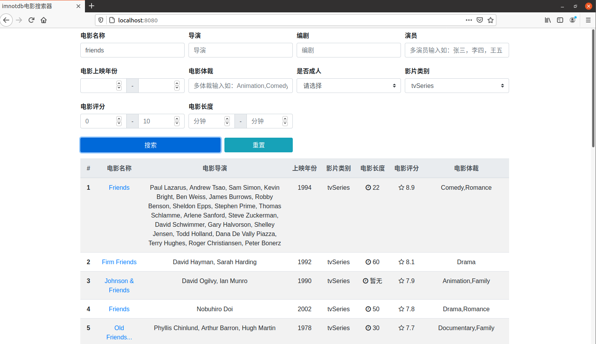
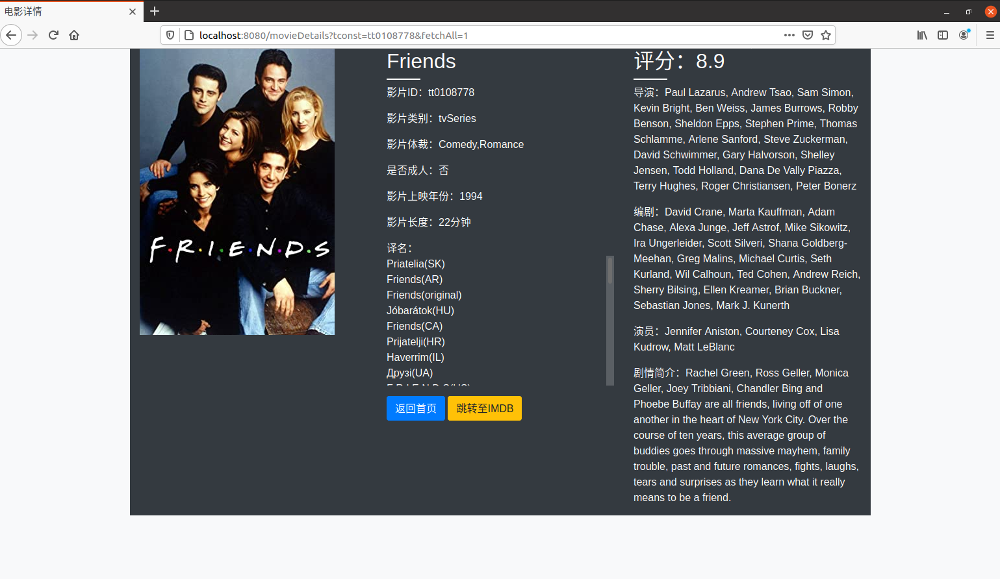

# imnotdb

一个对imdb数据库进行多条件搜索的搜索器

## 框架

1. Bootstrap
2. Axios
3. Springboot
4. Elasticsearch

## 注意

项目其实在springboot分支下，main只是重构前的失败品

## 效果展示

## 开发者

1. [JohnsonLee](https://github.com/JohnsonLee-debug)
2. [Chains.Z](https://github.com/Chains-Z)